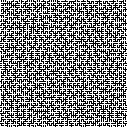

# Maze_generator
Creates mazes using Prim's algorithm

Originally created to learn more about Python as a language, apply algorithms I've learned in school, and make something fun for friends.

[maze_prims_pixels.py](/maze_prims_pixels.py) uses the pillow library to paint individual pixels. When upscaled, these images are the best for printing.

[maze_prims_animation.pyw](/maze_prims_animation.pyw) creates a maze using the pygame library to show the process of how the maze is generated using Prim's algorithm.

Example Images

